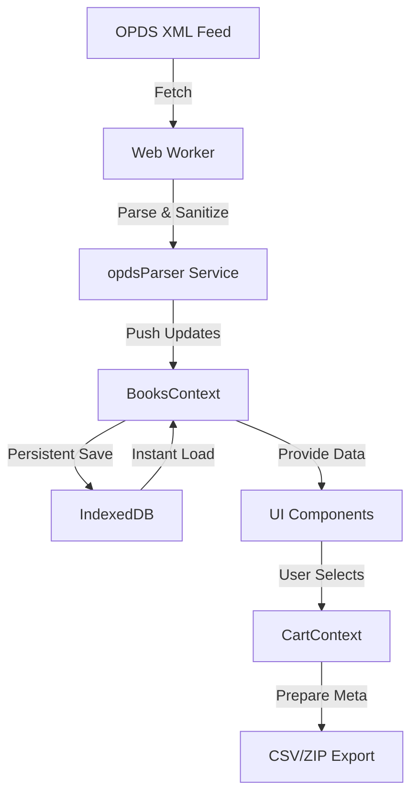

# StoryWeaver Frontend: Technical Documentation

## 1. Project Overview
StoryWeaver Frontend is a high-performance web application designed to browse, filter, and manage thousands of children's stories fetched from the StoryWeaver OPDS catalog. The application prioritizes accessibility, smooth user experience, and fast perceived performance through IndexedDB caching and background data synchronization.

---

## 2. Technical Stack
| Category | Technology |
| :--- | :--- |
| **Core** | React 18, TypeScript, Vite |
| **Styling** | Tailwind CSS (Utility-first), Framer Motion (Animations) |
| **Icons** | Lucide React |
| **Routing** | React Router DOM v6 |
| **Storage** | IndexedDB (via `idb` library) |
| **Parsing** | `fast-xml-parser` |

---

## 3. Architecture & Data Flow

### 3.1 Data Flow Diagram


### 3.2 Core Services
*   **`opdsParser.ts`**: The central data entry point. It initiates background synchronization and manages subscribers to data updates.
*   **`filterEngine.ts`**: Logic for cross-referencing books against active filters (Languages, Levels, Categories). Includes a strict level-normalization algorithm.
*   **`searchAlgorithm.ts`**: A weighted scoring system for searching books.
    *   **Weights**: Title (40%), Publisher (36%), Tags (12%), Author (15%).

### 3.3 Workers
*   **`opds.worker.ts`**: To avoid UI jank, XML parsing and catalog traversal are offloaded to this Web Worker. It uses a `ConcurrencyLimiter` and emits data in progressive batches.

---

## 4. Source File Analysis

### 4.1 Root & Configuration
*   `App.tsx`: Main router configuration and global provider assembly.
*   `index.css`: Global design tokens, custom scrollbars, and Tailwind layers.
*   `tailwind.config.js`: Custom color palette (Primary, Secondary, Accent) and animation aliases.

### 4.2 Application State (`src/context`)
- **`BooksContext`**: Global book registry. Manages `loading`, `error`, and `filterOptions` states.
- **`CartContext`**: Manages a `Map<string, Book>` for efficient selection/deselection of items.
- **`NotificationContext`**: A toast system for user feedback (success/error messages).

### 4.3 Database Model (`src/types/opds.ts`)
```typescript
interface Book {
  id: string;
  title: string;
  author: string;
  sumary: string;
  cover: string; // High-res cover image URL
  thumbnail?: string; // Low-res placeholder
  downloadLink: string;
  language: string;
  level?: string; // Normalized to "Level 1-4"
  categories: string[];
  publisher?: string;
  publishedDate?: string;
  rating?: number;
  tags: string[];
}
```

---

## 5. UI Components & Pages

### 5.1 Main Pages
1.  **Home (`App.tsx`)**: Combines `Hero`, `Header`, `FilterSidebar`, and `BookGrid`.
2.  **`ReviewSelection.tsx`**: Table view of selected books with a statistical summary of the dataset.
3.  **`Payment.tsx`**: Secure checkout gateway (currently simulates transaction).
4.  **`DownloadPage.tsx`**: Successful purchase screen providing CSV/ZIP export functionality.
5.  **`BookDetails.tsx`**: Dedicated page for single-book metadata and read actions.

### 5.2 Key Components
*   **`BookGrid`**: Supports Grid/Table view modes and infinite-scroll-friendly pagination.
*   **`FilterSidebar`**: Advanced filtering with native language support (native script names).
*   **`StepIndicator`**: Visual progress tracker for the 4-step selection-to-download process.
*   **`ImageWithLoader`**: Adaptive image component that handles broken covers and loading states.

---

## 6. Performance & UX Optimization

### 6.1 Progressive Loading
The application implements a "Stale-While-Revalidate" approach:
1.  **Step 1**: Load books from IndexedDB instantly on mount.
2.  **Step 2**: The Web Worker fetches fresh XML from the API.
3.  **Step 3**: The UI updates incrementally as new batches of books are parsed.

### 6.2 Scroll Management
- **`ScrollRestoration`**: Integrated with React Router to remember the user's position when navigating back from book details to the main catalog.
- **Removed Smooth Scroll**: Global smooth scrolling was removed to prevent navigation inconsistencies ("jumps") between different page heights.

### 6.3 Dynamic Assets
*   **`storyWeaverLanguages.ts`**: Comprehensive mapping of over 330 languages with their native scripts (e.g., "Bengali (বাংলা)").
*   **`storyWeaverCategories.ts`**: Mapping and normalization of source categories into standardized StoryWeaver themes.

---

## 7. Deployment & Environment
- **Env Variables**: Controlled via `.env` (e.g., `VITE_OPDS_URL`).
- **Build Tool**: Vite optimized build with asset hashing for long-term caching.
